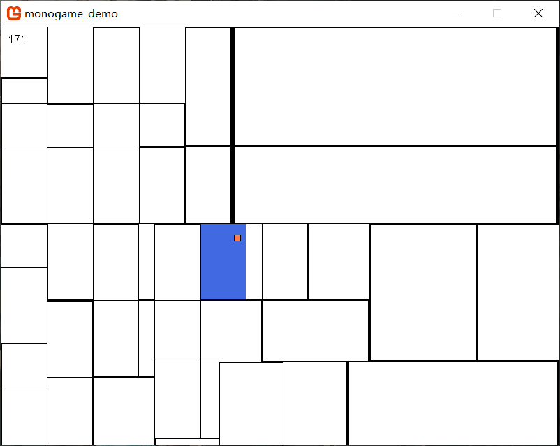

# Procedural Content Generation

## CURRENT STATUS

Constantly Pushing Up To Implement Algorithms.  

## ALGORITHM

### ~~Random Numbers~~

### ~~Height Map~~

### Sequence Generation

-   [ ] Lindenmayer Systems
-   [ ] Markov Chains

### Fill Space

-   [ ] Random Walks
-   [ ] Cellular Automata
-   [ ] Settling
-   [ ] Wang Tiles
-   [x] Binary Space Partition
    -   There seems some wrong judgements when the player intersects with the rooms (when player goes into room, some rooms that not intersected light up),
        -   
-   [ ] Voronoi Diagrams
-   [ ] Dijkstra Maps
-   [ ] Tree Mapping
